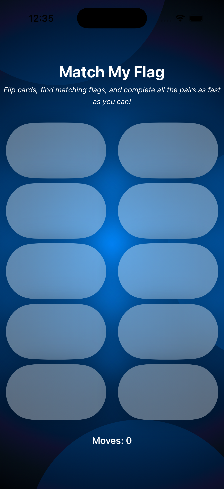
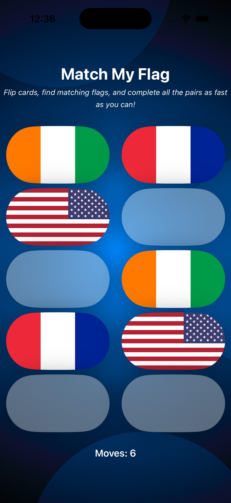
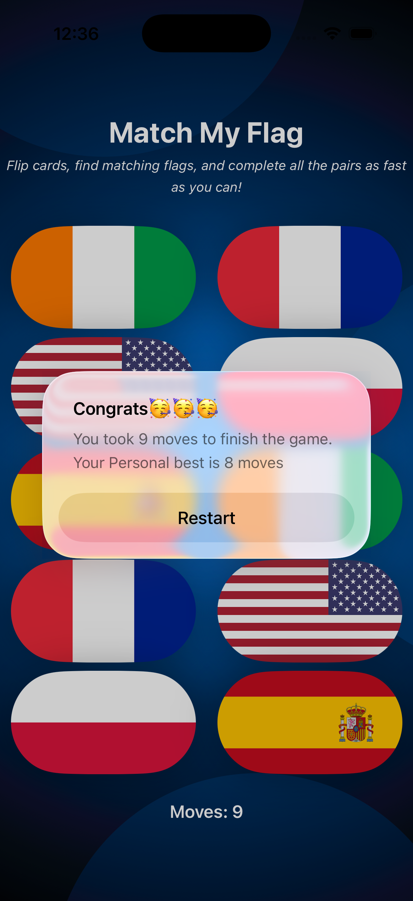

# 📱 MatchMyFlag
A fast, fun, and challenging memory game built with SwiftUI!

MatchMyFlag is a simple but addictive memory-testing game. You are presented with **10 face-down cards**. Behind each card is a **country flag**. Tap two cards at a time — if the flags match, they stay open. If they don’t, they flip back automatically. Your goal is to **find all matching pairs using the fewest moves possible**.

At the end of the game, the app congratulates you and displays your **best score**, which is saved using `UserDefaults`.

---

## 🎮 Gameplay

- 10 cards are placed face-down (5 matching pairs).
- Tap any two cards:
  - ✔️ If the flags match → the pair stays open.
  - ❌ If not → both cards flip back.
- Continue until you find all matching countries.
- When completed:
  - A congratulation message appears.
  - Your final number of moves is shown.
  - Your **personal best score** is updated if improved.

---

## ✨ Features

- 🧠 Memory-training gameplay  
- 🌍 Country flag graphics  
- 🎞️ Smooth animations & `rotation3DEffect` card flips  
- 🏆 Best score saved using `UserDefaults`  
- 💡 MVVM architecture for clean separation of logic  
- 🧩 Views organized using extensions for readability  
- ⚡ Lightweight and polished UI  

---

## 🛠️ Tech Stack

- **Swift**
- **SwiftUI**
- **MVVM**
- **UserDefaults** (persistent best score)
- **Animations** / `rotation3DEffect`
- **View Extensions**

---

## 🧪 How It Works

### 🔁 Card Flipping  
Cards flip using SwiftUI’s `rotation3DEffect` combined with smooth animations.

### 🏅 Best Score Tracking  
- Each completed game calculates total flips.  
- Compared against previously saved best score.  
- If better → stored in `UserDefaults`.

### 🚀 Restart  
A simple restart button resets the board and starts a new round. 

---

## 📸 Screenshots

<table>
  <tr>
      <td align="center">
      <strong>Home UI</strong> 
      
    </td>
    <td align="center">
      <strong>Working UI</strong> 
      
    </td>
    <td align="center">
      <strong>Working UI</strong> 
      
    </td>
  </tr>
</table>
